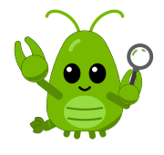

<p align="center">
  
</p>

# Alibi

The habit tracker that checks your alibi.

For students with more passions than hours, Alibi checks every habit against real evidence, steps in the moment they
drift, and plans the catch-up when they slip.

## The problem

Habit trackers trust you. You tick "drew for an hour" whether you drew or scrolled.
A week of ticks turns into a record of what you meant to do, not what you did.
By the time you notice you're behind, the week is gone and nobody suggested a way back.

## How it works

You tell Alibi what you're about to do ("draw for 25 minutes", "learn C++ for 30 min"). It gathers evidence while you
work and only ticks the habit if the evidence agrees. Three machines, three jobs:

- **The Mac is the witness.** A notch island takes the sentence and shows the session. For physical work, the desk
  camera is sampled once a minute and judged on the Mac by Apple Vision (people, hands, phone). For digital work, it
  reads the active window titles. macOS signals (presence, meetings, media, notification counts, git commits) add
  context. An opt-in focus guard (`FOCUS_GUARD=1`) puts a distracting front tab away mid-session.
- **The iPhone is the bouncer.** The companion app shields the apps you picked with Screen Time while a session runs,
  an app-open Shortcut automation nudges you the moment you open one anyway, and it reports phone pickups and Apple
  Health (steps, sleep, workouts).
- **The DGX Spark never sleeps.** An OpenClaw agent runs around the clock in a NemoClaw sandbox, on Nemotron 3 Super
  via NVIDIA Build. It reads Alibi's summaries, keeps a memory of what slipped and why, and writes the morning,
  checkpoint and night briefs. It can't start, stop or change anything. See [docs/AGENT.md](docs/AGENT.md).

Runs come from **Strava**: say "going for a run" and the claim settles when the run shows up there.

## Features

- **Sessions with evidence.** Each session keeps its proof: a contact sheet of timestamped frames, or a breakdown of
  what was on screen.
- **Verdicts.** Done, partial or slacked, scored from the evidence. Phone and Mac signals can lower a score, with a
  stated reason; they never raise it.
- **Nudges.** "You said drawing. I've seen your phone for 3 minutes." drops out of the notch mid-session.
- **Corrections.** Click any sample to relabel it; the verdict re-scores and the correction stays on the record.
- **Nightly review.** At 22:00 Nemotron runs a tool-calling loop over your week (week status, plan, free gaps,
  history) and proposes one recovery block. Nothing changes until you press Accept. With no model, a rules picker
  makes the same kind of proposal.
- **Briefs.** A morning brief that remembers last night's promise, checkpoints at 12:00, 16:00 and 20:00 that only
  speak when something changed, and a night report of claimed vs seen.
- **Plan the next three days** from the dashboard's plan page or the iPhone: move, skip or add a block. An accepted
  night-review block shows up as a catch-up.
- **Habits editor.** Habits, aliases, weekly targets and schedules, from the dashboard (`habits.yaml` underneath).
- **Days off.** Mark days away; their blocks are skipped and the night planner leaves them alone.
- **Apple Calendar sync.** Planned blocks go to an "Alibi" calendar, verdicts are written back onto them, and a
  planned block that starts with nothing running offers to start the session.
- **Memories reel.** Every camera session becomes a short timelapse.
- **Pinch.** A green detective lobster whose mood comes from the state of your day.

## Privacy

- **Camera.** With the default witness (`VISION_BACKEND=apple`), frames are judged on the Mac by Apple Vision and
  never leave it. The camera is off whenever no session is running. If you switch to `VISION_BACKEND=nvidia`, frames
  go to the vision model's endpoint (NVIDIA Build unless `VLM_BASE_URL` points at your own server), and with
  `VLM_VIDEO=1` one-minute clips go to NVIDIA.
- **Text model.** When an NVIDIA key and model are configured, what you type, window titles and app names, and habit
  names and minutes go to NVIDIA Build (or to the server `LLM_BASE_URL` names).
- **The agent** on the Spark sees summaries only: habit names, minutes, planned times, statuses and aggregate counts.
  Never frames, window titles, app names, location coordinates or notification text.
- **Optional services** are contacted only when you set them up: Strava (your runs) and ntfy (pushes, which can name
  the app, site or short window title you drifted to).
- **No key, no network.** Everything works offline: the Apple Vision witness and rule-based fallbacks for every model
  step.

The dashboard's Signals page lists what leaves the Mac, where it goes and why (`GET /api/signals/egress`).

## Quickstart

macOS with Python 3 and the Xcode command line tools.

```bash
bash scripts/setup.sh      # once: venv, deps, builds Alibi.app and the native helpers
cp .env.example .env       # optional: NVIDIA Build key and model IDs (setup.sh creates it if missing)
./alibi.sh up              # start, or double-click Alibi.app
./alibi.sh test            # every test, about 15 s, no keys, no camera
```

Then hover the notch (or press **⌥⌘A** anywhere) and type what you're about to do, or tap a habit chip. The dashboard
is at http://127.0.0.1:8765 (`./alibi.sh open`); its Setup drawer shows what's working (camera, window titles,
witness, model, Strava) and edits your habits and weekly targets.

| Command | What |
|---|---|
| `./alibi.sh down` | stop everything, camera off |
| `./alibi.sh status` | what's running, current session |
| `./alibi.sh say "learn C++ for 30 min"` | talk to it from the terminal |
| `./alibi.sh seed` | a pre-filled week in `data/demo` |
| `./alibi.sh demo` | a 2-minute live session with fast sampling (`--fixture`: no camera) |
| `.venv/bin/python scripts/smoke_test.py` | check the configured text and vision models answer |
| `bash ios/build_install.sh` | build the iPhone companion and install it over USB |
| `bash scripts/spark_setup.sh` | set up the agent on a DGX Spark ([docs/SPARK.md](docs/SPARK.md)) |

### Witnesses (`VISION_BACKEND`)

- `apple` (default): Apple Vision on the Mac: people, hands, phone. Frames never leave the Mac.
- `nvidia`: a vision-language model on NVIDIA Build, or your own OpenAI-compatible server via `VLM_BASE_URL`.
- `mock`: colour-coded frames, for tests.

## Layout

```
alibi/        Python daemon + FastAPI: verifier, witness, evidence, nudges, digests, report, Strava, calendar
  db.py       the data contract: tables `sessions` and `events`
  relay.py    runs on the Spark: the only door between the agent's sandbox and the Mac
  web/        dashboard, plan, signals and focus pages
native/       Swift: notch island (hosts the daemon in Alibi.app), Apple Vision witness, macOS signals, calendar
ios/          iPhone companion, Screen Time monitor and shield extensions, Live Activity
spark/        the agent: OpenClaw skill, heartbeat, brief jobs, egress preset, keep-alive
scripts/      setup, native build, demo, seed, model smoke test, Spark setup
tests/        hermetic tests, run by tests/run_all.sh
docs/         AGENT.md, SPARK.md, SIGNALS.md (the signals contract), design/ (tokens, design system, Pinch)
habits.yaml   your habits, aliases, weekly targets and schedules
data/         runtime data: personal, git-ignored
```

## Tests

`./alibi.sh test` runs every test in `tests/run_all.sh`, each in a fresh temporary data directory with a fake clock,
the mock witness, and Mac signals and Shortcuts turned off. No keys, no camera, no network, about 15 seconds. Run
one with `.venv/bin/python tests/test_p1.py`.
