<p align="center">
  
</p>

# Alibi

The habit tracker that checks your alibi.

For students with more passions than hours, Alibi checks every habit against real evidence, steps in the moment they
drift, and plans the catch-up when they slip.

<p align="center">
  <a href="docs/media/alibi-demo.mp4">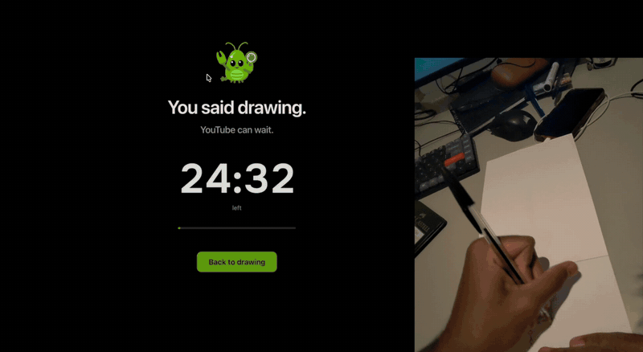</a>
  <br><sub><a href="docs/media/alibi-demo.mp4">Watch the demo video</a></sub>
</p>

## The problem

Habit trackers trust you. You tick "drew for an hour" whether you drew or scrolled.
A week of ticks turns into a record of what you meant to do, not what you did.
By the time you notice you're behind, the week is gone and nobody suggested a way back.

## How it works

You tell Alibi what you're about to do ("draw for 25 minutes", "learn C++ for 30 min"). It gathers evidence while you
work and only ticks the habit if the evidence agrees. Three machines, three jobs:

- **The Mac is the witness.** A notch island takes the sentence and shows the session. For physical work, the desk
  camera is sampled once a minute and judged on the Mac by Apple Vision (people, hands, phone). For digital work, it
  reads the active window titles. macOS signals (presence, meetings, media, notification counts, git commits) add
  context. An opt-in focus guard (`FOCUS_GUARD=1`) puts a distracting front tab away mid-session.
- **The iPhone is the bouncer.** The companion app shields the apps you picked with Screen Time while a session runs,
  an app-open Shortcut automation nudges you the moment you open one anyway, and it reports phone pickups and Apple
  Health (steps, sleep, workouts).
- **The DGX Spark never sleeps.** An OpenClaw agent runs around the clock in a NemoClaw sandbox, on Nemotron 3 Super
  via NVIDIA Build. It reads Alibi's summaries, keeps a memory of what slipped and why, and writes the morning,
  checkpoint and night briefs. It can't start, stop or change anything. See [docs/AGENT.md](docs/AGENT.md).

Runs come from **Strava**: say "going for a run" and the claim settles when the run shows up there.

## The day, read back

Verdicts say whether a session counted. The day review says why the others didn't. Every evening Alibi reads the
day back against your plan: phone pickups by the hour, how many landed inside planned blocks, which habit they hit
hardest, minutes lost to distracting sites and apps on the Mac, and up to three changes for tomorrow. All of it is
counted on the Mac by code (`alibi/focus.py`). No model guesses a number.

<p align="center">
  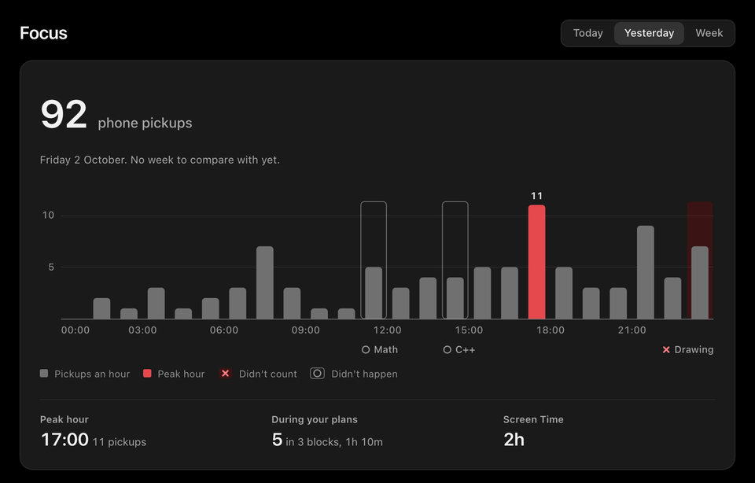
  <br><sub>Friday, as Alibi counted it: my real phone and Mac, read-only.</sub>
</p>

Two real days this week:

| | Thu 1 Oct | Fri 2 Oct |
|---|---|---|
| Phone pickups | 81 | 92 |
| Peak hour | 15:00, 8 pickups | 17:00, 11 pickups |
| Inside planned blocks | 16, across 5 blocks | 5, across 3 blocks |
| Distracting sites and apps on the Mac | 18 min | 34 min |
| What to change | "None of your 5 blocks happened; your phone was picked up 81 times. One 20-minute block tomorrow, phone away." | "Phone away for C++: 6 pickups an hour during it." |

### The advice follows the pickups

<p align="center">
  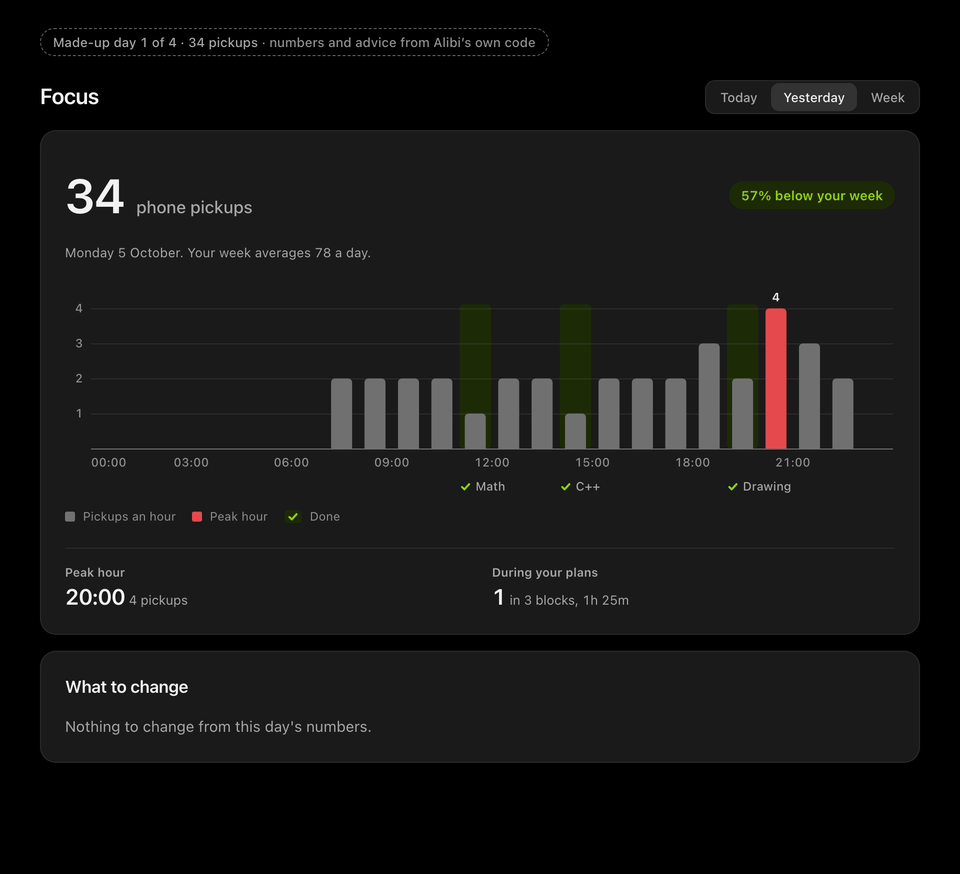
  <br><sub>Four made-up days, counted and advised by the same code.</sub>
</p>

34 pickups and every block done: nothing to change. Five of 73 inside the 30-minute C++ block: phone away for C++.
The phone's 19:00 peak on top of the Drawing block: don't plan Drawing at 19:00. 92 pickups and no block at all: one
20-minute block tomorrow, phone away. The agent gets the same numbers and rules, never a site or an app name.

### The agent turns it into tomorrow

The always-on agent on the DGX Spark gets the same numbers, never a site, a window title or a URL. At 22:00
Nemotron 3 Super plans one catch-up block with tool calls (your week, your pickups by hour, tomorrow's plan, the free
gaps) and steers it away from the phone's peak hour. At 22:05 the OpenClaw agent posts the night brief: today's
pickups, the habit that suffered most and one change for tomorrow, which it writes to its memory. At 07:32 the
morning brief reminds you. Nothing changes until you press Accept.

<p align="center">
  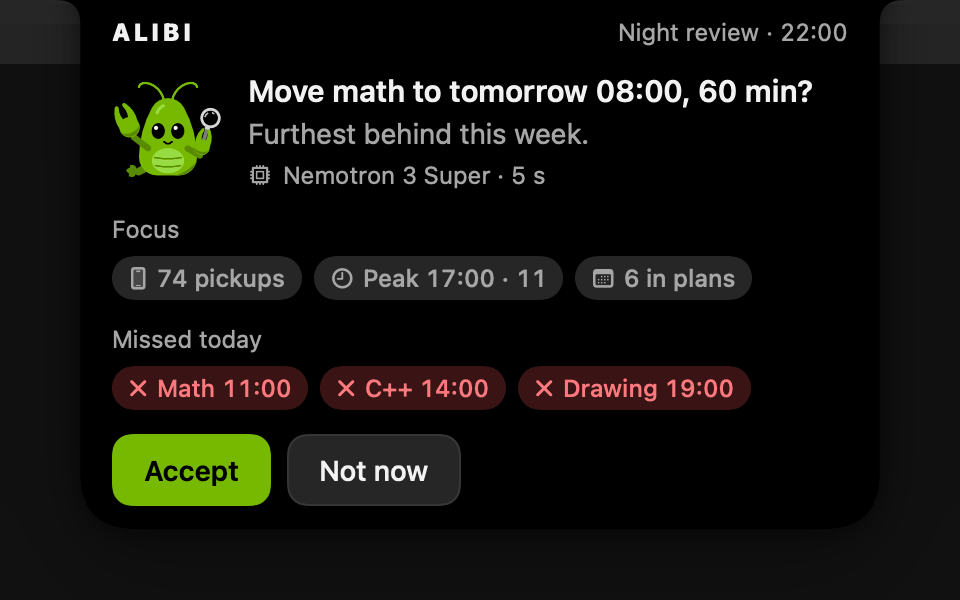
  <br><sub>Friday's real night review on the notch, replayed by today's code: 74 pickups synced by 22:00, three missed blocks, and Accept, pressed on a copy.</sub>
</p>

<p align="center">
  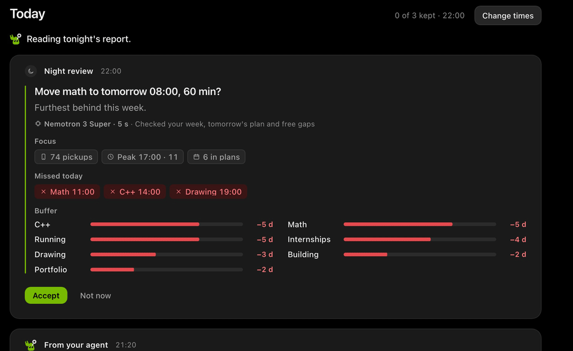
  <br><sub>The same review on the dashboard, with what the planner checked and each habit's buffer. Accept puts math on tomorrow's plan.</sub>
</p>

### Your calendar, as it happened

<p align="center">
  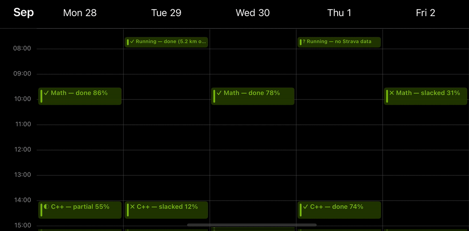
  <br><sub>A demo week in Apple Calendar on the iOS Simulator, written by Alibi's calendar sync.</sub>
</p>

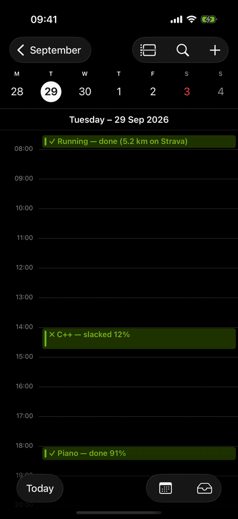

Planned blocks go to an "Alibi" calendar, and each verdict is written back onto its block: ✓ done, ◐ partly done,
✗ slacked or didn't happen, ? no Strava data yet. Open one and the notes say what Alibi saw: when it started, how
much was on task, and which witness saw it.

No Strava data yet doesn't count against you. A block that never started does.

<br clear="right">

## See it work

<table>
<tr>
<td width="50%" valign="top">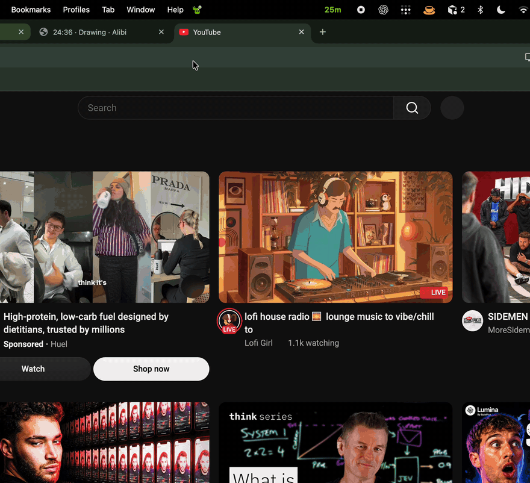<br><b>Drift, and it steps in.</b> Mid-session, a YouTube tab becomes Alibi's focus page and the notch nudges you back.</td>
<td width="50%" valign="top">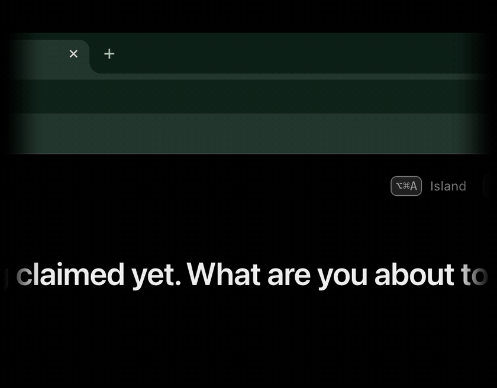<br><b>Say it to the notch.</b> Hover the notch for what's left today, then say what you're about to do.</td>
</tr>
<tr>
<td width="50%" valign="top">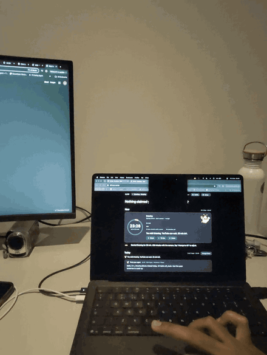<br><b>Work happens off-screen too.</b> Drawing on paper while the session runs; the desk camera is judged on the Mac.</td>
<td width="50%" valign="top">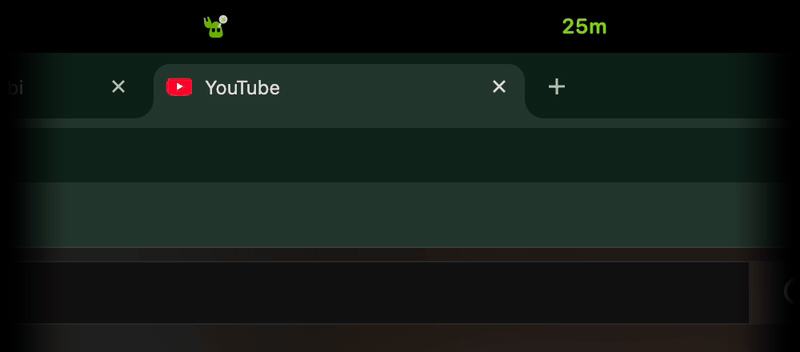<br><b>A nudge, not a lecture.</b> "You said drawing. YouTube can wait." with one tap back.</td>
</tr>
<tr>
<td width="50%" valign="top">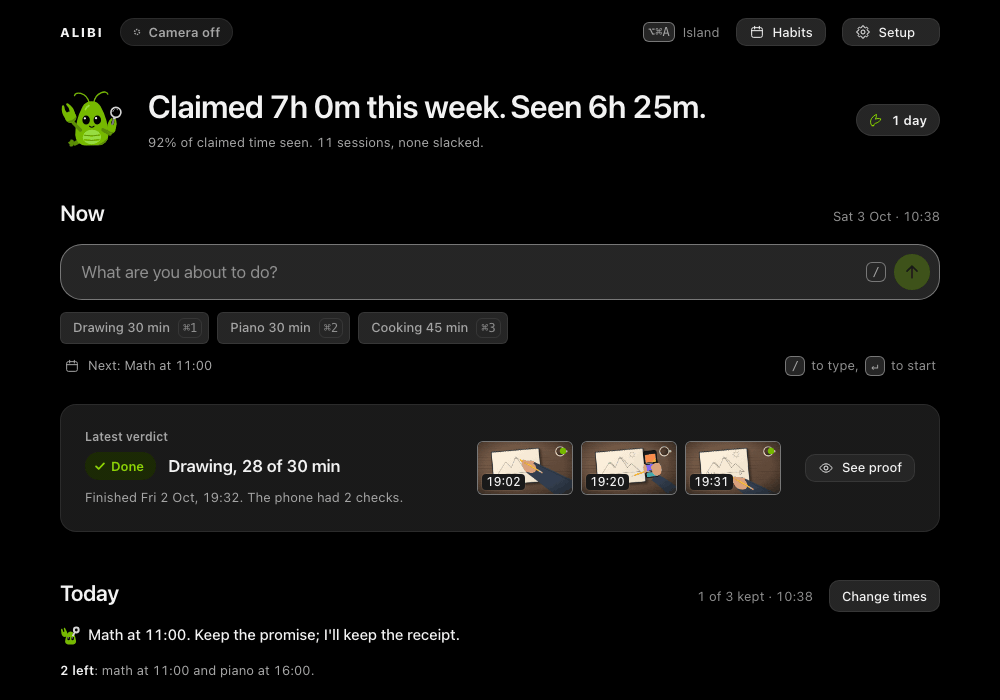<br><b>The dashboard.</b> Claimed against seen, today's plan, the week, and a session started from one sentence. Shown on demo data.</td>
<td width="50%" valign="top">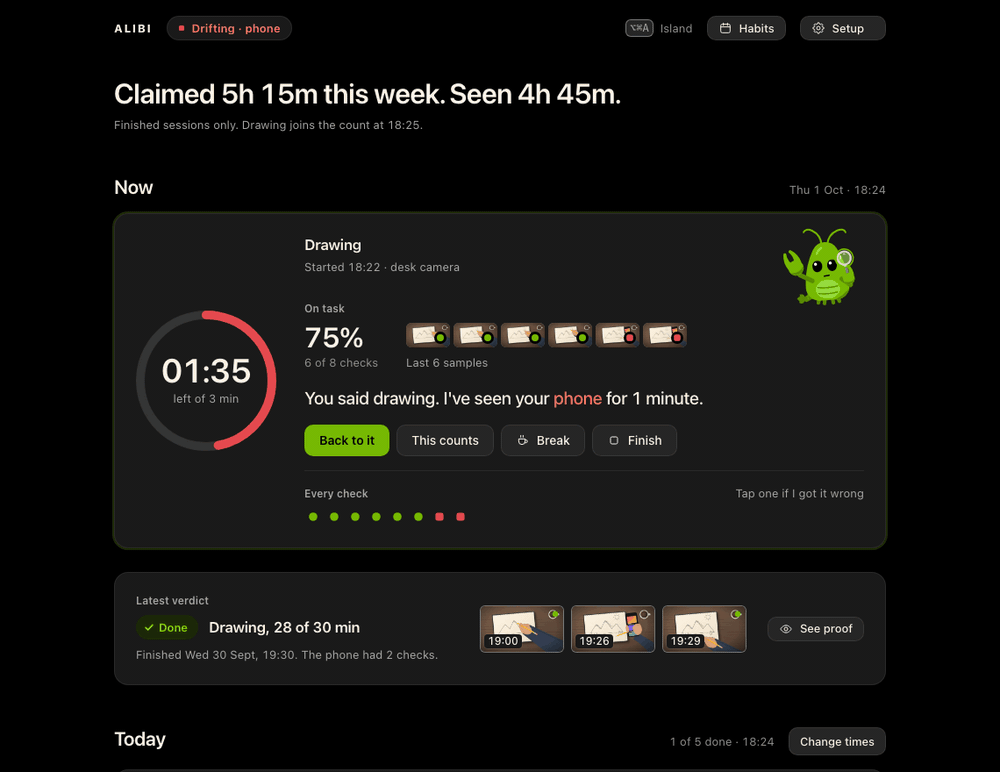<br><b>Drift, nudge, verdict.</b> The phone comes out, the ring turns red, and the verdict keeps the proof frames. Shown on demo data.</td>
</tr>
<tr>
<td width="50%" valign="top">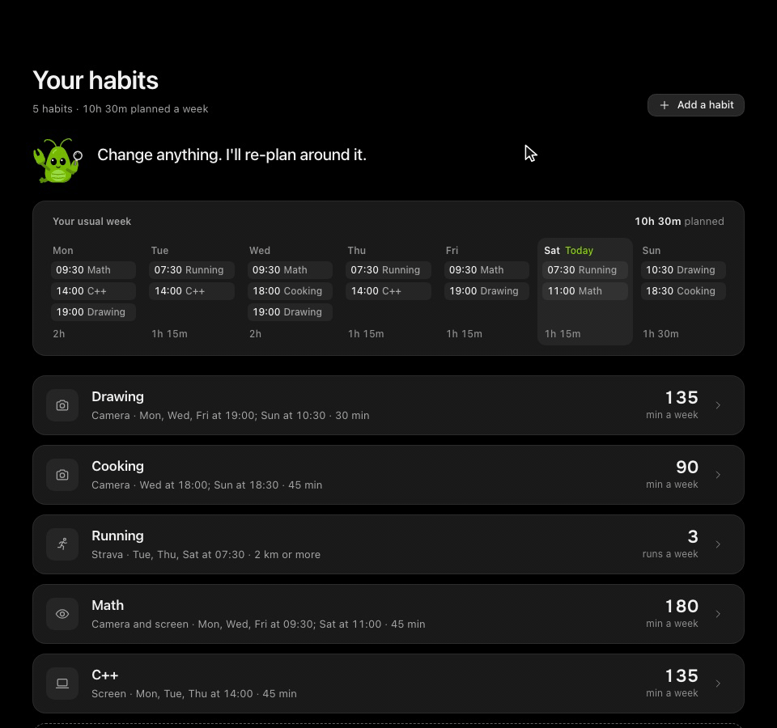<br><b>Add a habit.</b> Pick a template, set the days and a time; the week re-plans around it. Shown on demo data.</td>
<td width="50%" valign="top">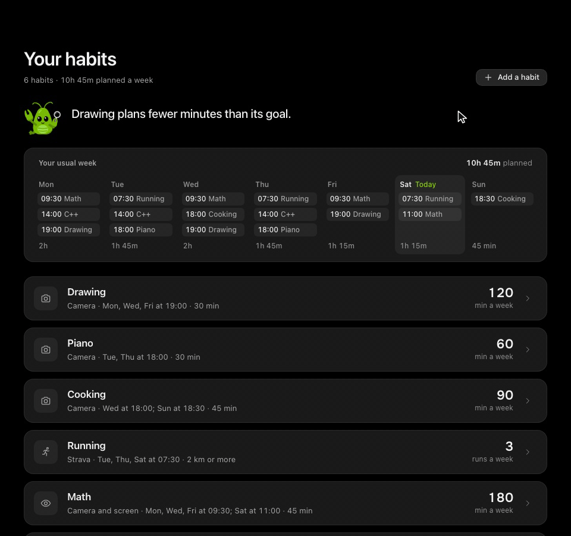<br><b>Edit a schedule.</b> Move Drawing to 20:30 and add Saturday; the goal is covered and the week re-plans. Shown on demo data.</td>
</tr>
<tr>
<td width="50%" valign="top">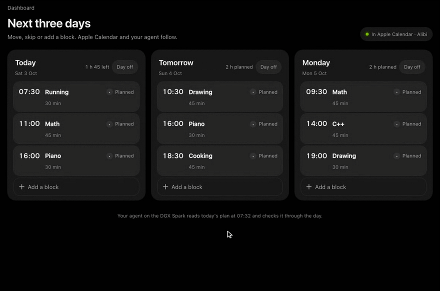<br><b>Plan the next three days.</b> Move a block, add a one-off, take a day off. Shown on demo data.</td>
<td width="50%" valign="top">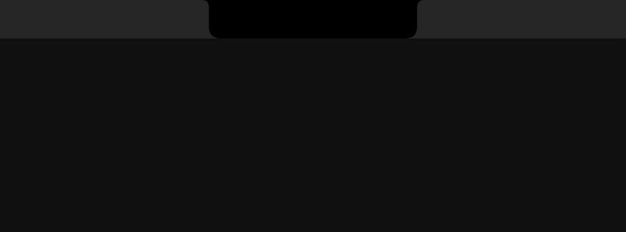<br><b>The notch through a session.</b> Idle, live, nudge, verdict, and a run settled by Strava. Rendered from test fixtures.</td>
</tr>
</table>

### On the iPhone

The companion app, recorded in the iOS Simulator on the app's demo data.

<table>
<tr>
<td width="33%" valign="top">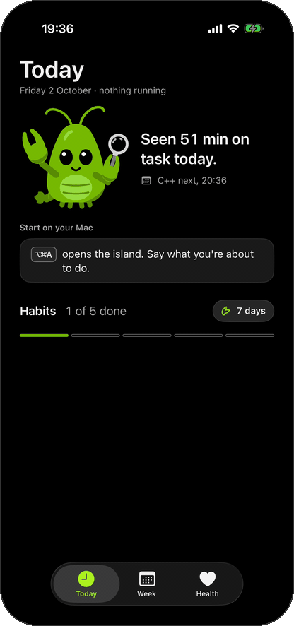<br>Today, live, drifting, the verdict and the week.</td>
<td width="33%" valign="top">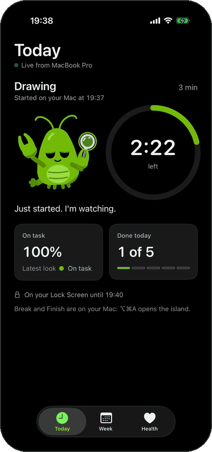<br>The session on the Dynamic Island and the Lock Screen.</td>
<td width="33%" valign="top">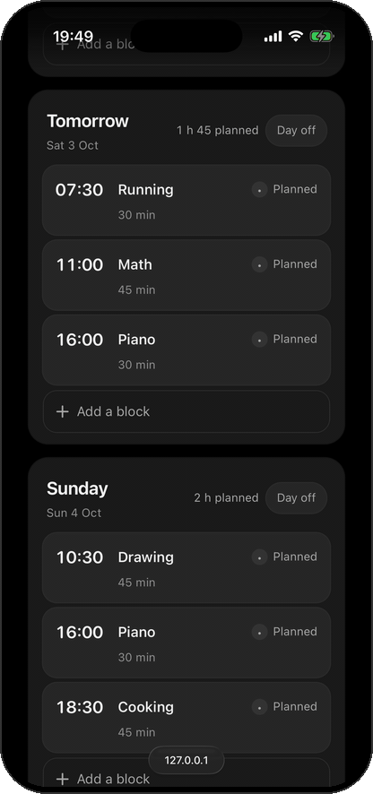<br>Move tomorrow's block from your phone.</td>
</tr>
</table>

## Features

- **Sessions with evidence.** Each session keeps its proof: a contact sheet of timestamped frames, or a breakdown of
  what was on screen.
- **Verdicts.** Done, partial or slacked, scored from the evidence. Phone and Mac signals can lower a score, with a
  stated reason; they never raise it.
- **Nudges.** "You said drawing. I've seen your phone for 3 minutes." drops out of the notch mid-session.
- **Corrections.** Click any sample to relabel it; the verdict re-scores and the correction stays on the record.
- **Day review.** Phone pickups by the hour against your plan, pickups inside each block, the habit they hit
  hardest, distracting minutes on the Mac, and up to three changes for tomorrow, counted by code. Today, yesterday
  and the week on the dashboard; the night card and the agent's briefs carry the same numbers.
- **Nightly review.** At 22:00 Nemotron runs a tool-calling loop over your week (week status, your pickups by hour,
  plan, free gaps, history) and proposes one recovery block away from the phone's peak hour. Nothing changes until
  you press Accept. With no model, a rules picker makes the same kind of proposal.
- **Cards, not paragraphs.** The night review, the agent's briefs and run results arrive as structured
  cards on the notch and the dashboard: the question, where the answer came from, what slipped, and Accept.
- **Briefs.** A morning brief that remembers last night's promise, checkpoints at 12:00, 16:00 and 20:00 that only
  speak when something changed, and a night report of claimed vs seen.
- **Plan the next three days** from the dashboard's plan page or the iPhone: move, skip or add a block. An accepted
  night-review block shows up as a catch-up.
- **Habits editor.** Habits, aliases, weekly targets and schedules, from the dashboard (`habits.yaml` underneath).
- **Days off.** Mark days away; their blocks are skipped and the night planner leaves them alone.
- **Apple Calendar sync.** Planned blocks go to an "Alibi" calendar, verdicts are written back onto them, and a
  planned block that starts with nothing running offers to start the session.
- **Memories reel.** Every camera session becomes a short timelapse.
- **Pinch.** A green detective lobster whose mood comes from the state of your day.

## Privacy

- **Camera.** With the default witness (`VISION_BACKEND=apple`), frames are judged on the Mac by Apple Vision and
  never leave it. The camera is off whenever no session is running. If you switch to `VISION_BACKEND=nvidia`, frames
  go to the vision model's endpoint (NVIDIA Build unless `VLM_BASE_URL` points at your own server), and with
  `VLM_VIDEO=1` one-minute clips go to NVIDIA.
- **Text model.** When an NVIDIA key and model are configured, what you type, window titles and app names, habit
  names and minutes, and the night planner's pickup counts go to NVIDIA Build (or to the server `LLM_BASE_URL`
  names).
- **The agent** on the Spark sees summaries only: habit names, minutes, planned times, statuses, phone pickup counts
  and other aggregate counts. Never frames, window titles, app or site names, URLs, location coordinates or
  notification text.
- **Optional services** are contacted only when you set them up: Strava (your runs) and ntfy (pushes, which can name
  the app, site or short window title you drifted to).
- **No key, no network.** Everything works offline: the Apple Vision witness and rule-based fallbacks for every model
  step.

The dashboard's Signals page lists what leaves the Mac, where it goes and why (`GET /api/signals/egress`).

## Quickstart

macOS with Python 3 and the Xcode command line tools.

```bash
bash scripts/setup.sh      # once: venv, deps, builds Alibi.app and the native helpers
cp .env.example .env       # optional: NVIDIA Build key and model IDs (setup.sh creates it if missing)
./alibi.sh up              # start, or double-click Alibi.app
./alibi.sh test            # every test, about 3 min, no keys, no camera
```

Then hover the notch (or press **⌥⌘A** anywhere) and type what you're about to do, or tap a habit chip. The dashboard
is at http://127.0.0.1:8765 (`./alibi.sh open`); its Setup drawer shows what's working (camera, window titles,
witness, model, Strava) and edits your habits and weekly targets.

| Command | What |
|---|---|
| `./alibi.sh down` | stop everything, camera off |
| `./alibi.sh status` | what's running, current session |
| `./alibi.sh say "learn C++ for 30 min"` | talk to it from the terminal |
| `./alibi.sh seed` | a pre-filled week in `data/demo` |
| `./alibi.sh demo` | a 2-minute live session with fast sampling (`--fixture`: no camera) |
| `.venv/bin/python scripts/smoke_test.py` | check the configured text and vision models answer |
| `bash ios/build_install.sh` | build the iPhone companion and install it over USB |
| `bash scripts/spark_setup.sh` | set up the agent on a DGX Spark ([docs/SPARK.md](docs/SPARK.md)) |

### Witnesses (`VISION_BACKEND`)

- `apple` (default): Apple Vision on the Mac: people, hands, phone. Frames never leave the Mac.
- `nvidia`: a vision-language model on NVIDIA Build, or your own OpenAI-compatible server via `VLM_BASE_URL`.
- `mock`: colour-coded frames, for tests.

## Layout

```
alibi/        Python daemon + FastAPI: verifier, witness, evidence, nudges, digests, report, Strava, calendar
  db.py       the data contract: tables `sessions` and `events`
  relay.py    runs on the Spark: the only door between the agent's sandbox and the Mac
  web/        dashboard, plan, signals and focus pages
native/       Swift: notch island (hosts the daemon in Alibi.app), Apple Vision witness, macOS signals, calendar
ios/          iPhone companion, Screen Time monitor and shield extensions, Live Activity
spark/        the agent: OpenClaw skill, heartbeat, brief jobs, egress preset, keep-alive
scripts/      setup, native build, demo, seed, model smoke test, Spark setup
tests/        hermetic tests, run by tests/run_all.sh
docs/         AGENT.md, SPARK.md, SIGNALS.md (the signals contract), design/ (tokens, design system, Pinch)
habits.yaml   your habits, aliases, weekly targets and schedules
data/         runtime data: personal, git-ignored
```

## Tests

`./alibi.sh test` runs every test in `tests/run_all.sh`, each in a fresh temporary data directory with a fake clock,
the mock witness, and Mac signals and Shortcuts turned off. No keys, no camera, no network, about 3 minutes. Run
one with `.venv/bin/python tests/test_p1.py`.

## Built with

- An **OpenClaw** agent in a **NemoClaw** (OpenShell) sandbox on an **NVIDIA DGX Spark**, kept alive by a
  systemd timer (`spark/keepalive`).
- **Nemotron 3 Super** on **NVIDIA Build**: the agent's briefs and the nightly tool-calling review.
- **Apple Vision** on the Mac for the desk camera; **Tailscale** between the Mac, the iPhone and the Spark.

Made for the NVIDIA London Claw Agent Challenge, October 2026.
